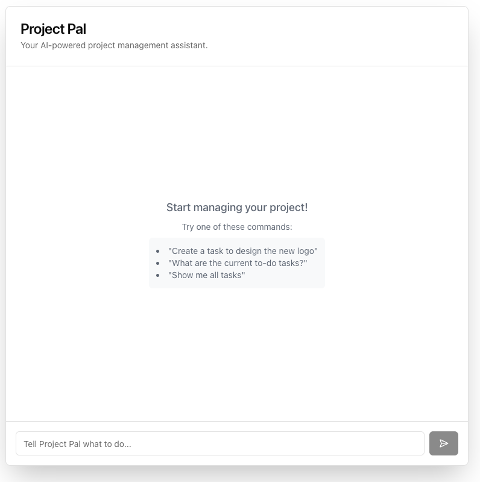

# Project Pal: An AI-Powered Project Management Assistant

Project Pal is a full-stack Next.js application that demonstrates how to build a powerful, AI-driven chatbot capable of performing real-world actions. It uses the **Model Context Protocol (MCP)** to securely connect a large language model (LLM) to a set of tools, allowing users to manage project tasks using natural language.



---

## Features

-   **Conversational Interface:** Manage your project tasks by talking to an AI in plain English.
-   **AI-Powered Actions:** The AI can create and retrieve tasks from a database.
-   **Secure Tool Use with MCP:** Built on the Model Context Protocol, ensuring a secure and decoupled architecture between the AI and the application's business logic.
-   **Dual API for Decoupled Architecture:** The backend provides two specialized endpoints to serve both the built-in Next.js frontend and any external Single Page Application (SPA).
-   **Modern Tech Stack:** Built with Next.js (App Router), the Vercel AI SDK, and shadcn/ui.

## Architecture Overview

This application is designed with a decoupled architecture, making it highly flexible.

1.  **The MCP Server (`/api/mcp`):** A secure, headless API that exposes "tools" (like `create_task` and `get_tasks`). It contains all the business logic and is the only part of the app that communicates with the database.
2.  **The Chat Endpoints:**
    -   **`/api/chat` (Streaming):** This endpoint provides a streaming response, designed for the built-in Next.js frontend using the Vercel AI SDK's `useChat` hook for a real-time "typing" effect.
    -   **`/api/chat-spa` (JSON):** This endpoint provides a standard JSON response, designed for external clients like a React, Vue, or Angular SPA.
3.  **The UI (`/app/page.tsx`):** A client-side chat interface built with React, shadcn/ui, and the Vercel AI SDK's `useChat` hook.

This separation ensures that the AI model never has direct access to your database and that you can support multiple frontend clients with a single backend.

## Getting Started

Follow these steps to get the application running locally.

### 1. Clone the Repository

```bash
git clone https://github.com/webmasterdevlin/mcp-example.git
cd mcp-example
```

### 2. Install Dependencies

```bash
npm install
```

### 3. Set Up Environment Variables

Create a file named `.env.local` in the root of your project and add your OpenAI API key:

```bash
# .env.local
OPENAI_API_KEY="sk-..."
```

You can get an API key from the [OpenAI Platform](https://platform.openai.com/api-keys).

### 4. Run the Development Server

```bash
npm run dev
```

Open [http://localhost:3000](http://localhost:3000) in your browser to see the application.

---

## Connecting to an External SPA

This project is built to serve not only its own frontend but also any external Single Page Application (SPA).

To connect your external SPA, make `POST` requests to the dedicated **`/api/chat-spa`** endpoint. This endpoint accepts a JSON body with a `messages` array and returns a single JSON object with the AI's response.

**Example `fetch` call from a React/Vue/Svelte app:**
```javascript
const response = await fetch('http://localhost:3000/api/chat-spa', {
  method: 'POST',
  headers: { 'Content-Type': 'application/json' },
  body: JSON.stringify({ messages: yourChatHistoryArray })
});
const data = await response.json();
// data.message will contain the AI's response
```

## Connecting a Database

By default, the application uses a temporary, in-memory mock database that **resets with every server restart**. To save your tasks permanently, you must connect a real database.

### Option 1: Using Supabase (Recommended)

1.  **Create a Supabase Project:** Go to [supabase.com](https://supabase.com), create a new project, and wait for it to be provisioned.

2.  **Create the `tasks` Table:** In your Supabase project, go to the **SQL Editor**, create a new query, and run the following script:
    ```sql
    CREATE TABLE tasks (
      id BIGINT PRIMARY KEY GENERATED ALWAYS AS IDENTITY,
      title TEXT NOT NULL,
      status TEXT NOT NULL DEFAULT 'todo',
      priority TEXT NOT NULL DEFAULT 'medium',
      created_at TIMESTAMPTZ NOT NULL DEFAULT NOW()
    );
    ```

3.  **Get API Credentials:** Go to **Project Settings > API**. Find and copy your **Project URL** and your **`anon` public API Key**.

4.  **Update Environment Variables:** Add your Supabase credentials to your `.env.local` file:
    ```bash
    # .env.local
    OPENAI_API_KEY="sk-..."
    NEXT_PUBLIC_SUPABASE_URL="YOUR_PROJECT_URL_HERE"
    NEXT_PUBLIC_SUPABASE_ANON_KEY="YOUR_ANON_KEY_HERE"
    ```

5.  **Restart your server.** The application is already configured to use these variables and will automatically connect to your Supabase database.

### Option 2: Using Neon or Any Other Database

The principle is the same for any database:

1.  Add your database connection details to `.env.local`.
2.  Install the necessary database client library (e.g., `pg` for PostgreSQL, `mysql2` for MySQL).
3.  Create a client instance in a new file (e.g., `lib/db.ts`).
4.  Go to `/app/api/mcp/route.ts` and replace the Supabase logic inside the `get_tasks` and `create_task` tools with the equivalent queries for your database.

---

## What's Missing in This Demo

This application is a proof-of-concept and is missing several features you'd want in a production application:

-   **User Authentication:** Currently, all tasks are global. There is no concept of individual users. You would need to add an authentication system (like NextAuth.js or Supabase Auth) to manage user-specific tasks.
-   **More Sophisticated Tools:** The AI can only create and get tasks. A real application would need tools for updating, deleting, and assigning tasks.
-   **UI Feedback for Tool Calls:** While the AI is thinking, the UI could provide more specific feedback, like "Creating your task..." instead of just a generic thinking indicator.
-   **Robust Error Handling:** While the server logs errors, the UI doesn't display them to the user in a friendly way.
-   **Persistent Chat History:** The conversation history is lost on every page refresh. You would need to store the AI and UI state in a database to make conversations persistent.